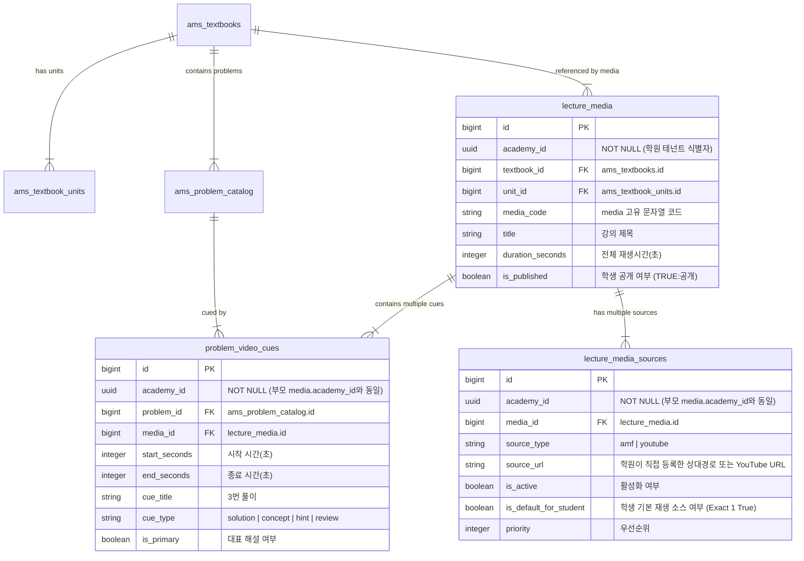

# 📐 Data v3 최소 사양서 (Minimum Specification)

> **문서 목적**: 본 문서는 AMS(Academy Management System) 및 오답노트(Hokmanote)의 교재·문항·영상 데이터 통합 관리를 위한 **Data v3 최소 사양 및 아키텍처 가이드**입니다.  
> *주의: 본 문서는 사전에 검토 및 기획 확정을 위한 명세서이며, 실제 DB 마이그레이션이나 코드는 작성/실행하지 않습니다.*

---

## 1. 🏗️ 엔티티별 책임 범위 (Entity Responsibilities)

| 엔티티 | 한글 명칭 | 책임 범위 (Single Responsibility) | 소유 범위 (Tenant Scope) |
| :--- | :--- | :--- | :--- |
| **`Textbook`** | 교재 마스터 | 교재의 표준 명칭, 영문 bookcode, 학년 구분, 개정 연도, 출판사 등 교재 자체의 불변 메타데이터 정의 | 공용 마스터 (`Global`) |
| **`Unit`** | 단원 | 교재 내부의 단원 순서(`unit_order`), 단원 코드(`unit_code`), 단원 명칭, 시작/끝 페이지 범위 관리 | 공용 마스터 (`Global`) |
| **`Problem`** | 문항 | 교재/페이지/문항 번호로 식별되는 개별 문제(`problem_code`), 난이도, 문제 유형, 키워드 및 Cue 정의 | 공용 마스터 (`Global`) |
| **`Media`** | 강의 콘텐츠 | 교재 또는 단원 단위의 해설 강의 동영상 콘텐츠 메타데이터 (`media_code`) | **학원 전용 (`academy_id NOT NULL`)** |
| **`Source`** | 재생 경로 | 특정 학원이 직접 등록·소유·관리하는 실제 물리적 재생 위치 (`amf` 상대 경로 및 `youtube` URL) | **학원 전용 (`academy_id NOT NULL`)** |
| **`Cue`** | 타임스탬프 책갈피 | 특정 학원이 소유한 문항(`Problem`)과 강의(`Media`)를 연결하는 시간 지점 (`problems` 탭 통합) | **학원 전용 (`academy_id NOT NULL`)** |

> 💡 **식별자 코드 규칙**: DB 내부 물리 조인은 `id` (bigint/uuid FK)로 처리하며, `bookcode`, `unit_code`, `media_code`, `problem_code`는 외부 시트/파일명/검수용 고유 문자열 코드로 활용됩니다.

---

## 2. 🌐 공용 데이터 vs 학원별 데이터 구분 (Global vs Tenant Data)

```text
 🌐 [공용 마스터 데이터 (Global Master - Read Only 공유)]
  ├── 공용 교재 메타데이터 (ams_textbooks)
  ├── 단원 및 페이지 범위 (ams_textbook_units)
  └── 표준 문항 카탈로그 및 이미지 규칙 (ams_problem_catalog)

 🏢 [학원 전용 데이터 (Tenant Private - academy_id NOT NULL)]
  ├── 학원별 교재 수강 등록 및 표시 별칭 (ams_academy_textbooks.custom_title)
  ├── 학원별 AMF 로컬 서버 주소 (Settings.base_server_url)
  ├── 학원 전용 강의 콘텐츠 (lecture_media: academy_id NOT NULL)
  ├── 학원 전용 재생 경로 (lecture_media_sources: academy_id NOT NULL)
  ├── 학원 전용 타임스탬프 책갈피 (problem_video_cues: academy_id NOT NULL)
  └── 학생별 정오답, 일지 제출, 오답노트 기록 (ams_wrong_answers)
```

---

## 3. 📊 3개 영상 테이블 ERD 및 학생 재생 소스 스위칭 사양



### 3.1 재생 소스 관리 및 학생 API 노출 제어 원칙
1. **교사/원장 다중 소스 보관**: 교사/원장은 동일 강의에 대해 AMF 상대경로(`amf`)와 YouTube URL(`youtube`)을 둘 다 등록 및 보관할 수 있습니다.
2. **학생 기본 재생 소스 (원칙 AMF)**:
   - 학생용 기본 재생 소스는 원칙적으로 **AMF**입니다.
   - YouTube source는 등록되어 있어도 기본적으로 **학생에게 노출하거나 API로 반환하지 않으며**, 학생 API는 오직 `is_default_for_student = true` 인 **단 1개의 기본 소스만 반환**합니다.
3. **교사/원장 전환 컨트롤 (`is_default_for_student`)**:
   - 교사/원장이 관리자 화면에서 해당 강의의 학생 기본 재생 소스를 AMF 또는 YouTube로 자유롭게 전환할 수 있습니다.
   - 동일한 `academy_id` + `media_id` 내에서 `is_default_for_student = true` 인 소스는 **정확히 단 1개만 유효**해야 합니다.
4. **`is_published` 필드**:
   - `lecture_media`의 `is_published = true`인 강의만 학생 화면에 공개 및 재생 가능한 상태가 됩니다.

---

## 4. 🔒 데이터 정합성 검증 및 인덱스/제약 사양

### 4.1 `academy_id` 데이터 정합성 검증 규칙 (Strict Tenant Validation)
1. **자식 레코드 `academy_id` 일치 검증**:  
   `lecture_media_sources`와 `problem_video_cues`의 `academy_id`는 **항상 연결된 부모 `lecture_media.academy_id`와 동일**해야 합니다.
2. **업로드 검증 파이프라인**:
   - 업로드 엑셀 파일에서는 `academy_id`를 사용자가 입력받지 않습니다.
   - 서버가 로그인 세션의 `auth.jwt() -> academy_id`를 강제 부여합니다.
   - 요청된 `media_id`로 부모 `lecture_media`의 `academy_id`를 조회하여 일치 여부를 검증합니다.
   - **`academy_id` 불일치 발견 시 즉시 저장 거부(Reject & Rollback)** 처리합니다.

### 4.2 제약 조건 (UNIQUE Constraints) 및 권장 인덱스 (INDEX)
```sql
-- 1. 학원별 미디어 소스 중복 방지 제약
ALTER TABLE lecture_media_sources 
ADD CONSTRAINT uk_media_source UNIQUE (academy_id, media_id, source_type);

-- 2. 학원별 미디어의 학생 기본 재생 소스 단 1개 보장 부분 인덱스 (Partial Unique Index)
CREATE UNIQUE INDEX uk_student_default_source 
ON lecture_media_sources (academy_id, media_id) 
WHERE (is_default_for_student = true);

-- 3. 학원별 문제 타임스탬프 중복 방지 제약
ALTER TABLE problem_video_cues 
ADD CONSTRAINT uk_problem_cue UNIQUE (academy_id, problem_id, media_id, cue_type, start_seconds);

-- 4. 권장 인덱스 (성능 최적화)
CREATE INDEX idx_media_pub ON lecture_media (academy_id, textbook_id, unit_id, is_published);
CREATE INDEX idx_source_act ON lecture_media_sources (academy_id, media_id, is_active);
CREATE INDEX idx_source_student_def ON lecture_media_sources (academy_id, media_id, is_default_for_student) WHERE (is_active = true);
CREATE INDEX idx_cue_prob ON problem_video_cues (academy_id, problem_id, is_primary);
CREATE INDEX idx_cue_time ON problem_video_cues (academy_id, media_id, start_seconds);
```

---

## 5. 🏷️ `problem_code` 및 이미지 파일명 규칙

### 5.1 규칙 포맷
```text
[bookcode]_p[3자리페이지]_q[4자리문항][서브구분].webp
```

### 5.2 규격 요소 설명
- **`bookcode`**: 영문 소문자, 숫자, 하이픈 조합 (예: `m11-gnssen`, `h11-rpm-cs1-25`)
- **`_p[3자리페이지]`**: 페이지 번호 3자리 고정 (예: 8페이지 ➔ `p008`)
- **`_q[문항]`**: 문항 번호 4자리 고정 (예: 1번 ➔ `q0001`, 67번 ➔ `q0067`)
- **`[서브구분]`**: 2단 편집 중복 교재의 경우 `-1`, `-2` 또는 `L`, `R` 접미사 부여

### 5.3 중요한 문항 이미지 규칙
- **문항 이미지 파일명은 `problem_code`와 1:1로 정확하게 일치**해야 합니다.
- 예: `m11-gnssen_p008_q0001.webp`, `m11-gnssen_p015_q0002.webp`
- ⚠️ **문항 이미지 파일명에는 단원 코드(`unit_code`)를 포함하지 않습니다.** 페이지와 문항 번호는 인쇄 교재 기준으로 안정적이지만, 단원 세분화 방식은 운영상 변경될 수 있기 때문입니다.

---

## 6. 🔗 AMF 상대 경로 + Settings 기본주소 조합 규칙

1. **상대 경로 보존**: 학원이 등록한 AMF 소스 경로에는 절대 IP 주소를 저장하지 않고 `/videos/{파일명}.mp4` 형태의 상대 경로만 보관합니다. (`source_type = amf`)
2. **Settings 기본주소 획득**: 현재 접속 학원의 `academy.operation_settings.base_server_url` (예: `http://192.168.0.109:8080`)을 읽어옵니다.
3. **안전 URL 조합 규칙**:
   ```typescript
   function buildAmfFullUrl(baseServerUrl: string, relativePath: string): string {
     if (!relativePath) return '';
     if (relativePath.startsWith('http://') || relativePath.startsWith('https://')) {
       return relativePath;
     }
     const cleanBase = (baseServerUrl || '').trim().replace(/\/+$/, '');
     const cleanRel = relativePath.trim().replace(/^\/+/, '');
     return `${cleanBase}/${cleanRel}`;
   }
   ```

---

## 7. 🎬 YouTube URL 및 시간 변환 규칙

1. **YouTube URL 판별 및 매개변수 규격**:
   - `autoplay=1`을 사용하지 않으며, 모바일 반응형 및 보안 규격을 위한 `playsinline=1`, `enablejsapi=1`, `origin` 파라미터를 적용합니다:
   ```text
   https://www.youtube.com/embed/VIDEO_ID?start=150&playsinline=1&enablejsapi=1&origin=https%3A%2F%2Fapp.ams.com
   ```
2. **플레이어 내 재생 시도 및 차단 안내 UX**:
   - 학생이 `[▶️ 강의 시청]` 버튼을 클릭하면 iFrame을 생성하여 재생을 시도합니다.
   - 브라우저의 자동재생 정책에 의해 재생이 차단된 경우, iFrame 중앙의 **유튜브 자체 재생 버튼을 누르도록 화면에 직관적인 안내** 문구를 표출합니다.
3. **시간 변환 규칙**:
   - 엑셀에는 기간 형식(예: `2:30`)으로 입력하고, 업로드 서버가 이를 초 단위(`150` 초)로 변환하여 DB의 `start_seconds` / `end_seconds` 에 저장합니다.

---

## 8. 📱 학생용 심플 UX: 단일 '강의 시청' 버튼 및 투명 재생

```text
 📱 [학생 모바일/PC 동영상 팝업 모달]
 ┌──────────────────────────────────────────────────────────┐
 │ 📚 개념쎈 중1-1 - 1번 문제 해설                             │
 ├──────────────────────────────────────────────────────────┤
 │                [ ▶️ 강의 시청 ]                          │ 👈 심플 단일 시청 버튼!
 ├──────────────────────────────────────────────────────────┤
 │                                                          │
 │               (동영상 플레이어 화면)                       │
 │  * 교사/원장이 지정한 is_default_for_student 소스로 재생   │
 │                                                          │
 └──────────────────────────────────────────────────────────┘
```

1. **단일 시청 버튼 UX**:
   - 학생 화면은 복잡한 선택 탭이나 소스 전환 옵션 없이 **항상 단일 `[▶️ 강의 시청]` 버튼 하나만 표시**됩니다.
2. **투명한 재생 원칙**:
   - 기본적으로 AMF 소스로 재생되며, 교사/원장이 관리 화면에서 기본 소스를 YouTube로 전환한 경우에도 학생 UI는 전혀 바뀌지 않고 **동일한 `[▶️ 강의 시청]` 버튼 클릭 시 YouTube 플레이어로 재생**됩니다.

---

## 9. 📝 RPM 공수1 1단원, p.18, 67번 학원 전용 레코드 예시 (`academy_id: "hokma-uuid"`)

### 9.1 `lecture_media` (학원 전용 강의)
```json
{
  "id": 101,
  "academy_id": "hokma-uuid",
  "textbook_id": 1001,
  "unit_id": 5001,
  "media_code": "h11-rpm-u01-1_sol",
  "title": "RPM 공수1 1단원 다항식의 연산 해설 (혹마학원 전용)",
  "duration_seconds": 5183,
  "is_published": true
}
```

### 9.2 `lecture_media_sources` (학원 직접 등록 재생 소스 - AMF 기본 선택)
```json
[
  {
    "id": 201,
    "academy_id": "hokma-uuid",
    "media_id": 101,
    "source_type": "amf",
    "source_url": "/videos/hokma_rpm_u01.mp4",
    "is_active": true,
    "is_default_for_student": true,
    "priority": 1
  },
  {
    "id": 202,
    "academy_id": "hokma-uuid",
    "media_id": 101,
    "source_type": "youtube",
    "source_url": "https://youtu.be/HOKMA_VIDEO_123",
    "is_active": true,
    "is_default_for_student": false,
    "priority": 2
  }
]
```

### 9.3 `problem_video_cues` (학원 전용 p.18, 67번 타임스탬프)
```json
{
  "id": 301,
  "academy_id": "hokma-uuid",
  "problem_id": 90067,
  "media_id": 101,
  "start_seconds": 1470,
  "end_seconds": 1545,
  "cue_title": "67번 풀이 (다항식의 곱셈)",
  "cue_type": "solution",
  "is_primary": true
}
```

---

## 10. 📄 데이터 업로드용 엑셀 5개 탭 컬럼 정의 & 업로드 보안 규칙 (`m11-gnssen_info.xlsx`)

### 10.1 확정된 교재 1권 5개 탭 구조
과거의 별도 `video_cues` 탭은 사용하지 않으며, 문제별 Cue 타임스탬프 정보는 **`problems` 탭에 완전히 통합**하여 입력합니다.

1. **`master`**
2. **`unit_page`**
3. **`problems`** (Cue 타임스탬프 정보 통합)
4. **`media`**
5. **`media_sources`**

### 10.2 탭별 헤더 명세
- **`master`**: `bookcode`, `title`, `grade_category`, `edition`, `publisher`, `hokmanote_name`, `status`, `target_session`
- **`unit_page`**: `unit_order`, `unit_code`, `unit_name`, `start_page`, `end_page`
- **`problems`**: `problem_code`, `media_code`, `start_time`, `end_time`, `cue_title`, `cue_type`, `is_primary`
- **`media`**: `media_code`, `unit_code`, `title`, `duration_time`, `is_published`
- **`media_sources`**: `media_code`, `source_type`, `source_url`, `is_active`, `is_default_for_student`, `priority`

---

## 11. 🔒 RLS & 테넌트 격리 원칙 (Tenant Isolation Rules)

1. **공용 마스터 카탈로그 (Textbook / Unit / Problem)**:
   - 모든 학원이 읽기 전용(Read-Only SELECT)으로 안전하게 공유 조회가 가능합니다.
2. **교사/원장 권한 (`lecture_media`, `lecture_media_sources`, `problem_video_cues`)**:
   - 오직 본인의 `academy_id`와 일치하는 영상, AMF 경로, YouTube URL, Cue 데이터에 대해서만 CRUD(생성·조회·수정·삭제) 권한이 부여됩니다.
3. **학생 권한 (시청 모드)**:
   - **학생 시청 조건**: `학생 본인 academy_id` + `자기 배정 교재` + `is_published = true` + `is_active = true` + `is_default_for_student = true` 인 소스만 조회가 가능합니다.
4. **타 학원 접근 엄격 차단**:
   - 다른 `academy_id`의 영상 레코드, 로컬 AMF 상대 경로, YouTube URL, Cue 타임스탬프는 어떠한 경우에도 읽거나 수정할 수 없도록 RLS가 엄격히 차단합니다.

---

## 12. 🚀 1권 PoC ➔ 200권 확장 단계별 이행 계획

```text
 Phase 1: [1권 개념 검증 PoC]
  ├─ 대표 교재 1권 (개념쎈 중1-1 m11-gnssen_info.xlsx) 5개 탭 학원 전용 샘플 엑셀 정의
  ├─ 단일 '강의 시청' 버튼 및 교사/원장 재생 소스 전환(AMF vs YouTube) UI 검증
  └─ 학생 개인 페이지 오답 제출 ➔ 학원 전용 팝업 동영상 연동 검증

 Phase 2: [독립 패키지 파이프라인 구축]
  ├─ backend/data_v3/[bookcode]/ 엑셀 업로더 (서버 강제 academy_id 부여 및 기간->초 변환) 구축
  ├─ 숙제 페이지 ➔ 문항 수 자동 계산 & 홀수번 역산 알고리즘 탑재
  └─ Hokmanote 오답노트 PDF 생성 서버와의 data_v3 식별자 연동

 Phase 3: [200권 대규모 마스터 교재 확장]
  ├─ 공용 교재 마스터 200권 카탈로그 엑셀 일괄 업로드
  ├─ 복합 인덱스와 교재·단원·문항 단위의 범위 조회로 성능을 최적화
  └─ 학원별 개별 영상 소스 및 별칭(Alias) 100% 독립 관리 개시
```

---
*Data v3 확정 5탭 사양서 | DATA_V3_MINIMUM_SPEC.md*
