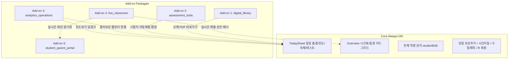

# AMS SaaS Add-on 상호 의존성 및 OFF 영향 분석 매트릭스 (Feature Flag Dependency Matrix)

> **문서 목적**: 향후 Master 관리자(`/master`)의 Feature On/Off 및 사이드바 메뉴 그룹화를 구현하기 전, 각 Add-on을 비활성화(OFF)할 때 Core 또는 다른 Add-on이 깨지지 않도록 실제 소스코드 기반의 전수 의존성 및 격리 안전성을 확정한 공식 기술 분석서입니다.  
> **최초 작성일**: 2026-08-29  
> **기준 문서**:
> - [`md/FEATURE_MODULE_INVENTORY.md`](file:///Users/joonsik_air/documents/makecode/academy-planner/md/FEATURE_MODULE_INVENTORY.md)
> - [`md/SAAS_SIMPLIFICATION_MODULARIZATION_PLAN.md`](file:///Users/joonsik_air/documents/makecode/academy-planner/md/SAAS_SIMPLIFICATION_MODULARIZATION_PLAN.md)

---

## 1. 6대 Add-on 패키지별 독립성 등급 요약

| FeatureKey | 패키지명 | 독립성 등급 | Core 영향도 | 타 Add-on 의존도 | OFF 안전성 |
| :--- | :--- | :---: | :---: | :---: | :---: |
| `digital_library` | **디지털 자료실 팩** | **높음 (High)** | 없음 (단순 뷰어) | 없음 | **매우 안전** |
| `assessment_tools` | **시험 & 문제은행 팩** | **높음 (High)** | 없음 (시험지 아카이빙) | 없음 | **매우 안전** |
| `analytics_operations` | **학원 운영 & 분석 팩** | **중간 (Medium)** | 낮음 (일부 딥링크 존재) | 낮음 | **안전 (딥링크 가드 필요)** |
| `live_classroom` | **실시간 수업 팩** | **중간 (Medium)** | 낮음 (플로팅 배너/단축키) | `student_parent_portal` | **안전 (실시간 배너 가드 필요)** |
| `student_parent_portal` | **학생/학부모 포털 팩** | **높음 (High)** | 없음 (외부 접속/알림톡) | `live_classroom` | **매우 안전** |
| `labs` | **실험실 (Experimental)** | **최고 (Highest)** | 없음 (독립 샌드박스) | 없음 | **매우 안전** |

---

## 2. Core Always-ON 체계 (분석 기준점)

> **⚠️ 원칙**: 아래 Core 기능은 Feature Flag 제어 대상이 아니며, 모든 Add-on이 OFF되어도 **100% 온전히 작동해야 하는 절대 기준선**입니다.

* **화면**: `TodaySheet` (`todayTable`), `Overview` (`board`), `학생정보수정` (`studentEdit`), `기본 Settings` (`settings`)
* **운영 엔진**: 시간표/정규 수업 대상 계산, **보강 추가, 시간이동(`moved_to_hour`), 수업 제외/취소 및 사유 기록, R 세션 리셋**
* **데이터 기록**: 출결, 진도, 숙제, 테스트 성적, 특이사항, 선생님 메모(`management_notes`)

---

## 3. [특별 정밀 조사] `analytics_operations` (학원 운영 & 분석 팩)

### 3.1 3대 하위 모듈별 소스코드 정밀 분석

#### ① 이번 달 변동 사항 (`monthlyChanges`)
* **진입점**: 사이드바 `이번 달 변동 사항` (`viewMode === 'monthlyChanges'`)
* **컴포넌트**: [`components/dashboard/MonthlyChanges.tsx`](file:///Users/joonsik_air/documents/makecode/academy-planner/components/dashboard/MonthlyChanges.tsx), [`MonthlyChangesLight.tsx`](file:///Users/joonsik_air/documents/makecode/academy-planner/components/dashboard/light/MonthlyChangesLight.tsx)
* **데이터 흐름**: `ams_students` 테이블의 `status_history`(퇴원/입원/휴원 이력) 및 `created_at` 데이터를 **읽기 전용(Read-Only)**으로 집계하여 통계 차트로 렌더링.
* **Core 영향 판정**: Core 데이터를 전혀 수정하지 않으며, Core 저장/출결 로직과 완전히 분리되어 있음 (**영향도 0%**).

#### ② 교재별 진도 (`progress`)
* **진입점**: 사이드바 `교재별진도` (`viewMode === 'progress'`), TodaySheet/Overview의 학생 [진도 보기] 딥링크 버튼
* **컴포넌트**: [`components/dashboard/ProgressSequencer.tsx`](file:///Users/joonsik_air/documents/makecode/academy-planner/components/dashboard/ProgressSequencer.tsx)
* **데이터 흐름**: `ams_students`, `ams_daily_logs`, `ams_master_textbooks`의 진도 로그를 읽어서 완독률 Gantt 차트로 시각화.
* **Core 영향 판정**:
  - TodaySheet의 일일 진도 텍스트 입력(`cwRef`, `ccwRef`)은 `ams_daily_logs`에 직접 저장되는 **Core 독립 기능**임.
  - `ProgressSequencer`는 축적된 로그를 분석하는 뷰어이므로, 진도 화면이 꺼져도 TodaySheet의 진도 입력/기록은 100% 정상 작동함.
  - **차단 필요 딥링크**: TodaySheet / Overview에서 학생 이름 클릭 시 뜨는 `[진도 보기]` 버튼 클릭 시 `viewMode='progress'`로 가지 않고 학생 기본 프로필 모달(`StudentDetailDrawer`)로 연결되도록 가드 필요.

#### ③ 업무/보강/설문 (`teacherTask`)
* **진입점**: 사이드바 `업무/보강/설문` (`viewMode === 'teacherTask'`), TodaySheet 결석 팝업 내 `[보강 일정 잡기]` 딥링크
* **컴포넌트**: [`components/dashboard/TeacherTasks.tsx`](file:///Users/joonsik_air/documents/makecode/academy-planner/components/dashboard/TeacherTasks.tsx), [`TaskLinksTab.tsx`](file:///Users/joonsik_air/documents/makecode/academy-planner/components/dashboard/TaskLinksTab.tsx), [`SurveyManagement.tsx`](file:///Users/joonsik_air/documents/makecode/academy-planner/components/dashboard/SurveyManagement.tsx)
* **데이터 테이블**:
  - 교사 업무: `ams_teacher_tasks`
  - 보강 캘린더: `ams_daily_logs` (전체 결석/보강 세션을 캘린더 형태로 조회 및 장기 보강일정 매핑)
  - 학부모 설문: `ams_surveys`
* **Core 보강 기능과의 독립성 판정 (가장 중요 ⭐⭐⭐)**:
  - **코드상 완전 분리 확인**: TodaySheet 상단 [보강 추가] 모달, 학생 등원시간 드롭다운 시간이동(`moved_to_hour`), 결석/수업제외 토글은 `app/[slug]/dashboard/page.tsx`의 Core 핸들러(`saveStudentSessionData`, `removeStudentFromToday`)를 통해 `ams_daily_logs`에 직접 저장됩니다.
  - `TeacherTasks`의 보강 캘린더는 이 로그들을 읽어서 월간/주간 캘린더로 보여주는 관리 화면일 뿐입니다.
  - 따라서 `analytics_operations`를 **OFF하더라도 TodaySheet와 Overview 내부의 당일 보강 추가, 시간이동, 수업제외, R 복원 기능은 100% 온전히 유지**됩니다.
  - **차단 필요 딥링크**: TodaySheet 결석 셀 팝업 하단의 `[보강 일정 연결하기 (onNavigateTab)]` 버튼만 숨김 처리.

---

## 4. 6대 Add-on별 세부 의존성 및 차단/보존 체크리스트



---

### 4.1 `digital_library` (디지털 자료실 팩)

| 항목 | 내용 |
| :--- | :--- |
| **메뉴 & `viewMode`** | • 교재 PDF 자료실 (`pdfLibrary`)<br>• 디지털 수학 서재 (`digitalLibrary`) |
| **주요 파일** | [`PdfLibraryView.tsx`](file:///Users/joonsik_air/documents/makecode/academy-planner/components/dashboard/PdfLibraryView.tsx), [`DigitalMathLibraryView.tsx`](file:///Users/joonsik_air/documents/makecode/academy-planner/components/dashboard/DigitalMathLibraryView.tsx) |
| **테이블 & API** | `ams_master_textbooks`, `ams_pdf_materials`, `ams_textbook_units`, `/api/textbooks/pdf` |
| **Core 의존성** | 전혀 없음 (단순 읽기 전용 뷰어) |
| **타 Add-on 연결** | 없음 |
| **OFF 시 차단할 UI** | • 사이드바 메뉴 2개 숨김<br>• `viewMode` 강제 접근 시 `todayTable` 리다이렉트<br>• `HomeworkEditor` 및 단원 팝업 내의 교재 PDF 열람 버튼 숨김 |
| **OFF 시 보존할 기능** | TodaySheet 및 Overview의 모든 교재명 선택, 진도 입력, 숙제 범위 텍스트 기록 |
| **보안/API 점검** | `/api/textbooks/pdf` 호출 시 테넌트 플래그 검증 가드 추가 권장 |

---

### 4.2 `assessment_tools` (시험 & 문제은행 팩)

| 항목 | 내용 |
| :--- | :--- |
| **메뉴 & `viewMode`** | • 기출문제 관리 (`exams`)<br>• 오답노트 관리 (`wrongAnswersAdmin`)<br>• 교재 오류 관리 (`problemErrors`) |
| **주요 파일** | [`ExamPaperManager.tsx`](file:///Users/joonsik_air/documents/makecode/academy-planner/components/dashboard/ExamPaperManager.tsx), [`WrongAnswerManager.tsx`](file:///Users/joonsik_air/documents/makecode/academy-planner/components/dashboard/WrongAnswerManager.tsx), [`ProblemErrorManager.tsx`](file:///Users/joonsik_air/documents/makecode/academy-planner/components/dashboard/ProblemErrorManager.tsx) |
| **테이블 & API** | `ams_exams`, `ams_exam_questions`, `ams_wrong_answers`, `ams_problem_errors`, `/api/exam/scan-omr`, `/api/pdf/[testId]` |
| **Core 의존성** | 없음. TodaySheet의 테스트 점수(`test_score`), 커트라인(`test_cut`) 입력은 Core 기본 기능으로 유지됨. |
| **타 Add-on 연결** | 없음 |
| **OFF 시 차단할 UI** | • 사이드바 3개 메뉴 숨김<br>• `viewMode` 접근 시 `todayTable` 리다이렉트<br>• TodaySheet `test_id` 셀의 기출 시험지 자동 채점 모달 연동 차단 (일반 텍스트 입력으로만 동작) |
| **OFF 시 보존할 기능** | TodaySheet의 테스트명 입력, 테스트 점수(점수/개수), 커트라인 통과 여부, 당일 테스트 결과 저장 |
| **보안/API 점검** | `/api/exam/scan-omr` 및 `/api/pdf/[testId]` API 검증 |

---

### 4.3 `analytics_operations` (학원 운영 & 분석 팩)

| 항목 | 내용 |
| :--- | :--- |
| **메뉴 & `viewMode`** | • 이번 달 변동 사항 (`monthlyChanges`)<br>• 교재별진도 (`progress`)<br>• 업무/보강/설문 (`teacherTask`) |
| **주요 파일** | [`MonthlyChanges.tsx`](file:///Users/joonsik_air/documents/makecode/academy-planner/components/dashboard/MonthlyChanges.tsx), [`ProgressSequencer.tsx`](file:///Users/joonsik_air/documents/makecode/academy-planner/components/dashboard/ProgressSequencer.tsx), [`TeacherTasks.tsx`](file:///Users/joonsik_air/documents/makecode/academy-planner/components/dashboard/TeacherTasks.tsx) |
| **테이블 & API** | `ams_teacher_tasks`, `ams_surveys`, `ams_students.status_history` |
| **Core 의존성** | 낮음 (진도보기 버튼 및 결석 팝업 내 캘린더 링크 2곳) |
| **타 Add-on 연결** | `MorningBriefingModal.tsx`에서 당일 `teacher_tasks` 요약 표시 (선택적) |
| **OFF 시 차단할 UI** | • 사이드바 3개 메뉴 숨김<br>• `viewMode` 접근 시 `todayTable` 리다이렉트<br>• TodaySheet/Overview의 [진도 보기] 버튼 클릭 시 `StudentDetailDrawer`로만 연결<br>• 결석 셀 팝업 내 `[보강 일정 연결하기]` 버튼 숨김 |
| **OFF 시 보존할 기능** | **TodaySheet 상단 [보강 추가] 모달, 등원시간 변경 시간이동, 출결 결석/수업제외 처리, R 복원 및 일일 진도/숙제 기록 100% 보존** |
| **보안/API 점검** | `ams_teacher_tasks` 쿼리 차단 |

---

### 4.4 `live_classroom` (실시간 수업 팩)

| 항목 | 내용 |
| :--- | :--- |
| **메뉴 & `viewMode`** | • 수업 시작 LIVE (`isClassroomModeOpen` $\rightarrow$ `ClassroomMode.tsx`)<br>• 학생 제출물 승인 모달 (`ApprovalModal.tsx`) |
| **주요 파일** | [`ClassroomMode.tsx`](file:///Users/joonsik_air/documents/makecode/academy-planner/components/dashboard/ClassroomMode.tsx), [`ApprovalModal.tsx`](file:///Users/joonsik_air/documents/makecode/academy-planner/components/dashboard/ApprovalModal.tsx) |
| **테이블 & API** | `ams_learning_hub`, Supabase Realtime 채널 |
| **Core 의존성** | 낮음 (대시보드 상단 승인 배너 및 단축키) |
| **타 Add-on 연결** | `student_parent_portal` (학생이 포털에서 실시간 답안 제출 시 `ApprovalModal`로 수신) |
| **OFF 시 차단할 UI** | • 사이드바 [수업 시작] 메뉴 숨김<br>• 대시보드 상단 `pendingSubmissions` 승인 대기 플로팅 버튼 숨김<br>• 단축키 `Shift + Alt + L` (클래스룸 모드 실행) 동작 차단<br>• Realtime 세션 구독 비활성화 |
| **OFF 시 보존할 기능** | TodaySheet의 개별 학생 타이머(`timer_started_at`, `timer_duration`), 선생님의 수동 출결 및 진도 완료 체크 |
| **보안/API 점검** | `/api/learning-hub` 웹소켓/폴링 엔드포인트 검증 |

---

### 4.5 `student_parent_portal` (학생/학부모 포털 팩)

| 항목 | 내용 |
| :--- | :--- |
| **메뉴 & `viewMode`** | • 학생 모바일 포털 (`/[slug]/student`)<br>• 학부모 리포트 카카오 알림톡 발송 (`report`) |
| **주요 파일** | [`app/[slug]/student/page.tsx`](file:///Users/joonsik_air/documents/makecode/academy-planner/app/%5Bslug%5D/student/page.tsx), [`StudentReportCardPrintModal.tsx`](file:///Users/joonsik_air/documents/makecode/academy-planner/components/dashboard/todaySheet/StudentReportCardPrintModal.tsx) |
| **테이블 & API** | `lib/studentSession.ts`, Solapi 메시지 API, `/api/report`, `/api/student/login` |
| **Core 의존성** | 전혀 없음 (학생 프로필 `studentEdit` 및 TodaySheet 기록과 완전 분리) |
| **타 Add-on 연결** | `live_classroom` (학생 포털 내 실시간 문제 풀이 및 제출) |
| **OFF 시 차단할 UI** | • `/[slug]/student` 접속 시 "현재 학원에서 학생 포털을 지원하지 않습니다" 안내 페이지 렌더링<br>• TodaySheet 상단 [리포트 발송] 버튼 숨김 또는 비활성화 |
| **OFF 시 보존할 기능** | 학생 프로필 관리, 학생 비밀번호 설정, TodaySheet 리포트 인쇄/PDF 미리보기 기능 |
| **보안/API 점검** | `/api/student/login` 및 `/api/report` API 호출 차단 |

---

### 4.6 `labs` (실험실 기능)

| 항목 | 내용 |
| :--- | :--- |
| **메뉴 & `viewMode`** | • 개발 중인 프로토타입 기능 샌드박스 |
| **기본값** | `false` (기본 비활성) |
| **Core 의존성** | 없음 |
| **타 Add-on 연결** | 없음 |
| **OFF 시 차단할 UI** | 사이드바 실험실 카드 및 모든 미출시 뷰 숨김 |
| **보안/API 점검** | 실험실 API 라우트 차단 |

---

## 5. Feature Flag 단계별 도입 순서 추천 및 근거

```
[Phase 1] digital_library (가장 독립적, 리스크 0%)
   ↓
[Phase 2] assessment_tools (시험지 아카이빙 격리, 리스크 낮음)
   ↓
[Phase 3] analytics_operations (딥링크 2개 가드 적용, Core 보강 무영향 확정)
   ↓
[Phase 4] live_classroom (상단 배너 및 단축키 차단)
   ↓
[Phase 5] student_parent_portal (외부 학생 로그인 및 알림톡 API 차단)
```

### 🎯 도입 순서 선정 근거
1. **1단계 (`digital_library`)**: Core와의 딥링크가 거의 없고 단순 읽기 뷰어이므로 **가장 안전한 PoC 대상**.
2. **2단계 (`assessment_tools`)**: 시험지 아카이빙 및 오답노트는 완전 독립 모듈이므로 사이드바와 뷰모드 가드만으로 즉시 분리 가능.
3. **3단계 (`analytics_operations`)**: 진도보기 딥링크(`onViewProgress`)와 결석 팝업 딥링크(`onNavigateTab`) 가드만 처리하면 Core 보강/시간이동 엔진에 전혀 영향 없이 깔끔하게 분리 가능.
4. **4~5단계 (`live_classroom`, `student_parent_portal`)**: 외부 학생 접속 및 Realtime 통신이 수반되므로 UI 가드와 함께 API 엔드포인트 보안 검증을 병행하여 적용.
