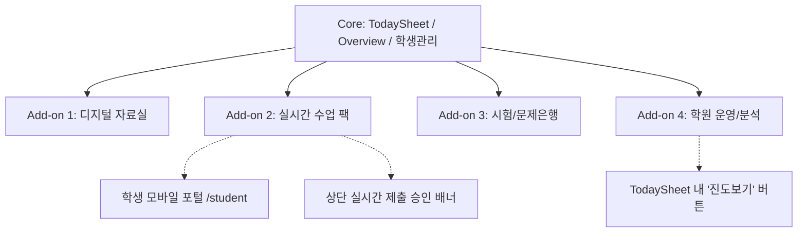

# AMS 기능 모듈화 인벤토리 (Feature Module Inventory)

> **문서 성격**: 현재 코드 기준의 모듈·메뉴·의존성 전수 조사 인벤토리입니다.  
> **SaaS 실행 계획**: Feature Flag 정책, 단계별 구현 로드맵, 보안/테넌트 격리 및 롤백 정책 등 구체적인 SaaS 실행 계획은 👉 [`md/SAAS_SIMPLIFICATION_MODULARIZATION_PLAN.md`](file:///Users/joonsik_air/documents/makecode/academy-planner/md/SAAS_SIMPLIFICATION_MODULARIZATION_PLAN.md)를 참조하십시오.

---

## 1. 전체 메뉴 및 모듈 매핑 인벤토리 (Total Inventory)

| 메뉴 순서 (ID) | 한글 표시명 | `viewMode` / 액션 | 주요 컴포넌트 & 파일 경로 | 관련 API & Supabase 테이블 | 권장 모듈 패키지 분류 |
| :--- | :--- | :--- | :--- | :--- | :--- |
| `todayTable` | **TodaySheet** | `todayTable` | [`components/dashboard/TodaySheet.tsx`](file:///Users/joonsik_air/documents/makecode/academy-planner/components/dashboard/TodaySheet.tsx) | `ams_daily_logs` `ams_students` `ams_master_textbooks` `/api/textbooks` | **Core (기본 필수)** |
| `board` | **Overview** | `board` | [`components/dashboard/Overview.tsx`](file:///Users/joonsik_air/documents/makecode/academy-planner/components/dashboard/Overview.tsx) | `ams_students` `ams_daily_logs` `ams_teachers` `/api/timetables` | **Core (기본 필수)** |
| `studentEdit` | **학생정보수정** (전체 학생 관리) | `studentEdit` | [`components/dashboard/Overview.tsx`](file:///Users/joonsik_air/documents/makecode/academy-planner/components/dashboard/Overview.tsx) (`hideTodaySection={true}`) | `ams_students` `ams_teachers` `ams_master_textbooks` | **Core (기본 필수)** |
| `settings` | **Settings** | `settings` | [`components/dashboard/SettingsView.tsx`](file:///Users/joonsik_air/documents/makecode/academy-planner/components/dashboard/SettingsView.tsx) | `ams_academies` `ams_teachers` `/api/teachers/[id]` | **Core (기본 필수)** |
| `live` | **수업 시작 (LIVE)** | `onStartClass()` (`isClassroomModeOpen`) | [`components/dashboard/ClassroomMode.tsx`](file:///Users/joonsik_air/documents/makecode/academy-planner/components/dashboard/ClassroomMode.tsx) [`components/dashboard/ApprovalModal.tsx`](file:///Users/joonsik_air/documents/makecode/academy-planner/components/dashboard/ApprovalModal.tsx) | `ams_daily_logs` `ams_students` `ams_learning_hub` | **Add-on 2: 실시간 수업 팩** |
| `pdfLibrary` | **교재 PDF 자료실** | `pdfLibrary` | [`components/dashboard/PdfLibraryView.tsx`](file:///Users/joonsik_air/documents/makecode/academy-planner/components/dashboard/PdfLibraryView.tsx) | `ams_master_textbooks` `ams_pdf_materials` `/api/textbooks/pdf` | **Add-on 1: 디지털 자료실 팩** |
| `digitalLibrary` | **디지털 수학 서재** | `digitalLibrary` | [`components/dashboard/DigitalMathLibraryView.tsx`](file:///Users/joonsik_air/documents/makecode/academy-planner/components/dashboard/DigitalMathLibraryView.tsx) | `ams_master_textbooks` `ams_textbook_units` `ams_textbook_problems` | **Add-on 1: 디지털 자료실 팩** |
| `exams` | **기출문제 관리** | `exams` | [`components/dashboard/ExamPaperManager.tsx`](file:///Users/joonsik_air/documents/makecode/academy-planner/components/dashboard/ExamPaperManager.tsx) | `ams_exams` `ams_exam_questions` `/api/pdf/[testId]` | **Add-on 3: 시험/문제은행 팩** |
| `wrongAnswersAdmin` | **오답노트 관리** | `wrongAnswersAdmin` | [`components/dashboard/WrongAnswerManager.tsx`](file:///Users/joonsik_air/documents/makecode/academy-planner/components/dashboard/WrongAnswerManager.tsx) | `ams_wrong_answers` `ams_students` `/api/exam/scan-omr` | **Add-on 3: 시험/문제은행 팩** |
| `problemErrors` | **교재 오류 관리** | `problemErrors` | [`components/dashboard/ProblemErrorManager.tsx`](file:///Users/joonsik_air/documents/makecode/academy-planner/components/dashboard/ProblemErrorManager.tsx) | `ams_problem_errors` `ams_master_textbooks` | **Add-on 3: 시험/문제은행 팩** |
| `monthlyChanges` | **이번 달 변동 사항** | `monthlyChanges` | [`components/dashboard/MonthlyChanges.tsx`](file:///Users/joonsik_air/documents/makecode/academy-planner/components/dashboard/MonthlyChanges.tsx) [`MonthlyChangesLight.tsx`](file:///Users/joonsik_air/documents/makecode/academy-planner/components/dashboard/light/MonthlyChangesLight.tsx) | `ams_students` (퇴원/입원/휴원/시간변경 이력) | **Add-on 4: 학원 운영/분석 팩** |
| `progress` | **교재별진도** | `progress` | [`components/dashboard/ProgressSequencer.tsx`](file:///Users/joonsik_air/documents/makecode/academy-planner/components/dashboard/ProgressSequencer.tsx) | `ams_students` `ams_daily_logs` `ams_master_textbooks` | **Add-on 4: 학원 운영/분석 팩** |
| `teacherTask` | **업무/보강/설문** | `teacherTask` | [`components/dashboard/TeacherTasks.tsx`](file:///Users/joonsik_air/documents/makecode/academy-planner/components/dashboard/TeacherTasks.tsx) | `ams_teacher_tasks` `ams_teachers` `ams_academies` | **Add-on 4: 학원 운영/분석 팩** |

---

## 2. 패키지별 상세 기능 및 분류 체계

### 🌟 [Core Plan] — 기본 필수 제공 (항상 ON, 비활성화 불가)
> 모든 학원의 운영 근간이 되는 '절대 안 터지는 무적의 코어'
1. **TodaySheet (`todayTable`)**:
   - 일일 수업 출결, 진도 기록, 숙제 관리, 테스트 결과 입력, 상담 특이사항.
   - 단축키(Alt+Q/W/E/R SET 전환), 셀 단위 즉각 저장 및 낙관적 UI 업데이트.
   - **당일 수업 운영(항상 ON)**: 보강 추가, 시간이동(`moved_to_hour`), 수업 제외/취소, 당일 수업 대상 자동 집계.
2. **Overview (`board`)**:
   - 오늘 등원생 타임라인/시간대별 카드 그리드, 미등원생 관리, 실시간 출결 현황.
   - 시간대별 등원생 이동 및 보강생 즉시 카드 배치.
3. **전체 학생 정보 관리 (`studentEdit`)**:
   - 전교생 프로필(이름/학교/학년/연락처), 요일별(`class_days`) 및 시간표(`day_schedules`) 배정.
   - 월/화/수/목/금/토/일 전용 요일 필터 및 검색.
4. **기본 설정 (`settings`)**:
   - 학원 기본 정보, 교사 계정 관리, 상담 주기 설정, 다크/라이트 테마 전환.

---

## 3. Core 내부 운영 기능 (항상 ON, 별도 Feature Flag 금지)

> **⚠️ 절대 원칙**: 보강, 시간이동, 당일 수업 추가/제외는 별도의 유료 Add-on이 아닌 **학원의 일일 수업 출결·진도·숙제 기록을 위한 Core 필수 운영 체계**입니다. Master Feature Flag에서 이 기능들을 On/Off하는 키는 생성하지 않습니다.

### 📌 당일 수업 제어 기능 상세 매핑

| 기능명 | 주요 진입 화면 / UI 위치 | 데이터 연동 (DB 컬럼 / State) | 비활성화 금지 사유 (Core 필수 이유) |
| :--- | :--- | :--- | :--- |
| **보강 추가 (Makeup Session)** | TodaySheet 상단 [보강 추가] 모달 Overview 내 [보강 추가] 버튼 | **DB 저장**: `ams_daily_logs` (`session_date`, `course_name`, `attendance_status`, `attendance_reason`, `moved_to_hour`, `absence_session_id`) **파생 상태**: `is_pure_makeup` (DB 미저장, 클라이언트 판정용 파생 플래그) | 당일 정규 수업 외에 추가로 등원한 학생의 출결/진도/숙제/테스트를 기록하는 유일한 경로이므로 필수. |
| **시간이동 (Reschedule / Move Hour)** | TodaySheet 학생 등원시간 셀 드롭다운 Overview 시간대 카드 드래그/이동 | **DB 저장**: `ams_daily_logs.moved_to_hour` **로컬 상태**: `student.todaySession.moved_to_hour` | 정규 시간과 다른 교시로 이동한 학생의 시간대별 필터링(`selectedHour`), 카드 배치 및 출결 관리를 위해 필수. |
| **수업 제외 / 취소 (Omit Session)** | TodaySheet 출결 상태(`결석`, `이동` 등) Overview 카드 내 상태 토글 | **DB 저장**: `ams_daily_logs.attendance_status` `ams_daily_logs.attendance_reason` | 결석 사유 및 수업 취소 기록을 남기고, 당일 수업 대상 통계/미등원 카운트에서 정확히 처리하기 위해 필수. |
| **당일 수업 대상 자동 계산** | `useTodaySheetRows.ts` `lib/studentDataEnricher.ts` | **DB 읽기**: `ams_students.day_schedules`, `class_days` `ams_daily_logs` (`session_date`, `moved_to_hour`, 보강 상태/사유) | 요일 스케줄과 당일 로그(`moved_to_hour`, 보강 로그)를 조합하여 오늘 출석 대상을 실시간 계산하므로 시스템 붕괴 방지용 필수. |

### 🔒 Feature Flag 설계 정책
1. **FeatureKey 후보 제외**: `FeatureKey` 목록(`digital_library`, `live_classroom`, `assessment_tools`, `analytics_operations` 등)에 `makeup`, `reschedule`, `session_management`와 같은 키는 **절대로 추가하지 않습니다**.
2. **독립 메뉴화 시 원칙**: 향후 별도의 "보강/시간이동 전용 관리 메뉴(예: 종합 보강 캘린더)"가 신설되어 메뉴 노출 여부만 토글되더라도, **TodaySheet 및 Overview 내부의 보강 추가, 시간이동, 수업 제외 기능은 영구적으로 항상 활성화(Always ON)** 상태를 유지합니다.

---

### 📦 [Add-on 1: 디지털 자료실 팩 (Digital Library Pack)]
> 태블릿/PC에서 교재 본문, 빠른답, 해설 PDF 및 스마트 뷰어를 활용하는 학원
1. **교재 PDF 자료실 (`pdfLibrary`)**:
   - 출판사/과목/교재별 본문, 빠른답, 해설 PDF 열람 및 고속 뷰어.
2. **디지털 수학 서재 (`digitalLibrary`)**:
   - 교재별 단원/문항 단위의 디지털 인덱스 브라우징 및 전자책 뷰어.
* **연계 차단 필요 영역**:
  - `HomeworkEditor` 및 진도 입력 팝업 내의 교재 PDF 바로가기 링크.

---

### ⚡ [Add-on 2: 실시간 수업 팩 (Live Classroom Pack)]
> 교사와 학생이 실시간으로 연결되어 태블릿 수업을 진행하는 스마트 학원
1. **수업 시작 LIVE 모드 (`isClassroomModeOpen` $\rightarrow$ `ClassroomMode.tsx`)**:
   - 수업 중 타이머, 학생별 실시간 진행 상태 모니터링, 실시간 집중 모드.
2. **학생 제출물 실시간 검사/승인 (`ApprovalModal.tsx`)**:
   - 대시보드 상단 플로팅 배너: `"{N}명 제출 검사 대기 중! 클릭해서 확인"`.
3. **학생 전용 모바일 포털 (`/[slug]/student`)**:
   - 학생 스마트폰/태블릿으로 실시간 답안 제출 및 개인 학습 현황 확인.
* **연계 차단 필요 영역**:
  - 대시보드 상단의 실시간 제출 대기 플로팅 배너 (`pendingSubmissions`).
  - Overview / TodaySheet 내 [수업 시작] 퀵 액션 버튼.

---

### 📝 [Add-on 3: 시험 & 문제은행 팩 (Exam & Question Bank Pack)]
> 기출문제, 오답노트 자동화, 문항 단위 관리를 집중적으로 운영하는 학원
1. **기출문제 관리 (`exams` $\rightarrow$ `ExamPaperManager.tsx`)**:
   - 중/고등학교별 기출 시험지 아카이빙, 문항별 정답/배점 매칭, PDF 자동 분할.
2. **오답노트 관리 (`wrongAnswersAdmin` $\rightarrow$ `WrongAnswerManager.tsx`)**:
   - 학생별 오답 자동 수집 및 맞춤형 오답 클리닉 시험지 생성.
3. **교재 오류 관리 (`problemErrors` $\rightarrow$ `ProblemErrorManager.tsx`)**:
   - 교재 내 오타, 정답 오류 제보 및 교사 간 공유 시스템.
* **연계 차단 필요 영역**:
  - TodaySheet의 `test_id` 입력 시 기출 시험지 자동 채점 매칭 API 호출.

---

### 📊 [Add-on 4: 학원 운영 & 분석 팩 (Academy Analytics Pack)]
> 재원생 추이, 진도 진척도, 교사 업무를 체계적으로 관리하는 중대형 학원
1. **이번 달 변동 사항 (`monthlyChanges` $\rightarrow$ `MonthlyChanges.tsx`)**:
   - 월별 신규 입원생, 퇴원생, 휴원생, 시간표 변동 학생 통계 및 증감 차트.
2. **교재별진도 (`progress` $\rightarrow$ `ProgressSequencer.tsx`)**:
   - 학생별 교재 완독률, 단원별 블록 진행 바(Gantt chart), 진도 지연 경고.
3. **업무/보강/설문 (`teacherTask` $\rightarrow$ `TeacherTasks.tsx`)**:
   - 교사 간 인수인계 업무 체크리스트, 보강 일정 배정, 학부모 설문 조사 관리.
* **연계 차단 필요 영역**:
  - TodaySheet / Overview의 학생 이름 클릭 시 뜨는 **[진도 보기 (onViewProgress)]** 딥링크 버튼 (진도 팩이 꺼져 있을 때는 학생 상세 프로필 모달로만 연결).

---

## 4. 의존성 맵 및 딥링크 연계 차단 규칙 (Cross-Feature Dependencies)

### 🔒 모듈 Off 시 필수 숨김/비활성화 체크리스트
1. **`Add-on 2 (실시간 수업)` OFF 시**:
   - 사이드바 `수업 시작 (LIVE)` 메뉴 숨김
   - 대시보드 상단 `pendingSubmissions` 승인 대기 플로팅 버튼 숨김
   - 단축키 `Shift + Alt + L` (클래스룸 모드 실행) 동작 차단
2. **`Add-on 4 (학원 분석)` OFF 시**:
   - 사이드바 `교재별진도` 메뉴 숨김
   - TodaySheet / Overview의 `[진도 보기]` 버튼 클릭 시 `viewMode='progress'`로 전환되지 않고 안내 토스트 표시 또는 버튼 숨김
3. **비활성화된 `viewMode`로 URL 직접 접근 시**:
   - `navigateTo(mode)` 및 URL 쿼리 파라미터에서 해당 학원의 플래그를 검사하여, 비활성화된 메뉴일 경우 자동으로 기본 Core 화면인 `'todayTable'`로 안전 리다이렉트.

---

## 5. 다크 / 라이트 Dashboard 동기화 구조

* **단일 공통 관리 컴포넌트**:
  - `TodaySheet.tsx` (다크/라이트 내부 통합)
  - `Overview.tsx` (다크/라이트 내부 통합)
  - `ProgressSequencer.tsx`, `SettingsView.tsx`, `ExamPaperManager.tsx`
* **분리 관리 컴포넌트**:
  - 사이드바: [`components/dashboard/Sidebar.tsx`](file:///Users/joonsik_air/documents/makecode/academy-planner/components/dashboard/Sidebar.tsx) (다크) ↔ [`SidebarLight.tsx`](file:///Users/joonsik_air/documents/makecode/academy-planner/components/dashboard/light/SidebarLight.tsx) (라이트)
  - 대시보드 진입점: [`app/[slug]/dashboard/page.tsx`](file:///Users/joonsik_air/documents/makecode/academy-planner/app/%5Bslug%5D/dashboard/page.tsx) ↔ [`dashboard-light/page.tsx`](file:///Users/joonsik_air/documents/makecode/academy-planner/app/%5Bslug%5D/dashboard-light/page.tsx)
  - 변동사항: [`MonthlyChanges.tsx`](file:///Users/joonsik_air/documents/makecode/academy-planner/components/dashboard/MonthlyChanges.tsx) ↔ [`MonthlyChangesLight.tsx`](file:///Users/joonsik_air/documents/makecode/academy-planner/components/dashboard/light/MonthlyChangesLight.tsx)
* **모듈화 적용 시 원칙**:
  - 향후 Feature Flagging 훅(`useAcademyFeatures()`)을 생성하여 다크/라이트 양쪽 사이드바와 대시보드에 **단일 Source of Truth**로 동일하게 적용.

---

## 6. 차기 구현 단계별 실행 로드맵 (Next Implementation Steps)

1. **[1단계] 공통 Feature Flag 스키마 및 상수 정의 (`lib/constants/features.ts`)**:
   - `FEATURE_KEYS = ['digital_library', 'live_classroom', 'assessment_tools', 'analytics_operations', 'student_parent_portal', 'labs']`
   - **원칙**: 보강, 시간이동, 수업 제외/취소는 Core 기본 운영 기능이므로 FeatureKey 목록에 절대 포함하지 않음.
   - 기본값: 플래그 데이터가 없는 기존 학원은 `ALL_ENABLED`로 fallback 처리 (기존 운영 무중단 보장).
2. **[2단계] DB 스키마 반영**:
   - `ams_academies` 테이블의 `operation_settings` JSONB에 `enabled_features: string[]` 필드 활용 (또는 전용 컬럼).
3. **[3단계] Sidebar & Dashboard 라우팅 조건부 렌더링 적용**:
   - 사이드바 메뉴 렌더링 시 `enabled_features.includes(menuId)` 검사.
   - 유효하지 않은 `viewMode` 접근 시 `'todayTable'` 리다이렉트 가드 추가.
4. **[4단계] Master 관리자 페이지(`/master`) 연동**:
   - 학원 카드에 4대 팩 On/Off 체크박스 토글 UI 추가.
   - 원클릭 3단계 프리셋(`[라이트 모드]`, `[스마트 모드]`, `[풀옵션 모드]`) 버튼 구축.
